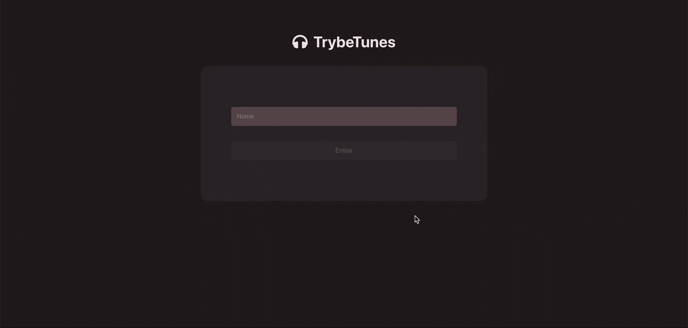

## TrybeTunes 🎧:

Note: the album page has a slight gradient, that is shown as a block in the gif preview. Please open the link to the project to see the actual look.

## About:

Small project developed at the for the <b>Front-End module</b> at Trybe.

The goal was to create a spotify-like app, with a simulated login page (only frontend for now), and where users could search for artists, access their albums, mark songs as favorites, play a short preview of each song, and edit their own profile.

Every page uses or simulates an async request to an API, therefore the "loading" text every time a new page is loaded. That was a pre-requisite from Trybe.

It was made using <b>ReactJS</b> class components, with state and props manipulation.

You can <a href="https://luacomacento.github.io/trybetunes/" target="_blank">click here</a> to check the current state of the application.

## Tools:
<ul>
  <li>ReactJS</li>
  <li>CSS3</li>
</ul>

## In works:
As of now, I am working on making the page mobile-friendly.
